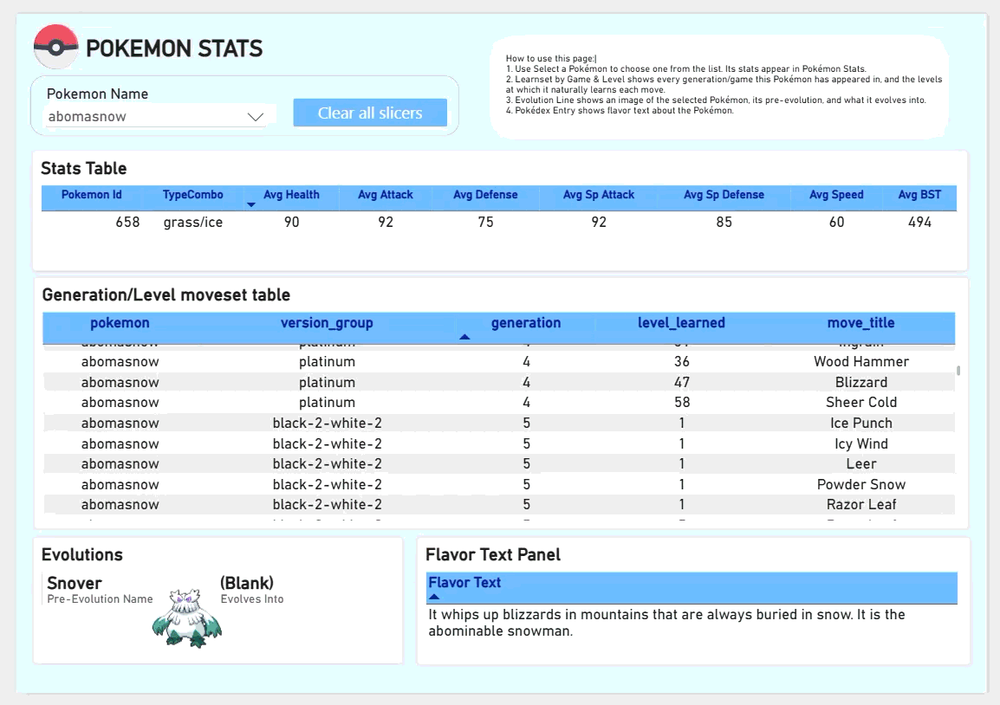
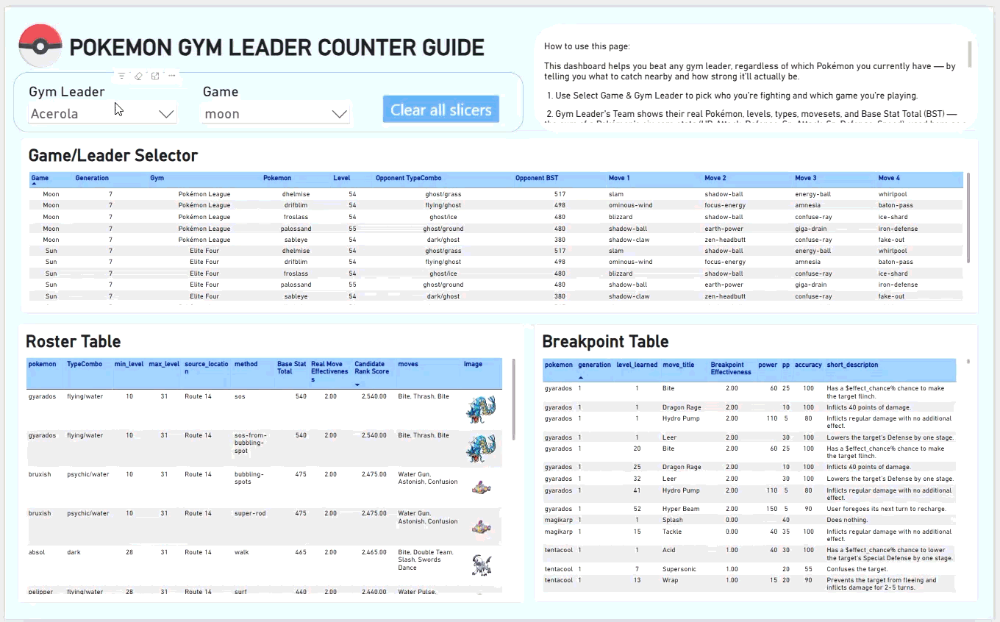

# Pokémon Dashboard Project

## Purpose

A personal project built for fun and practice — an exploration of how far I could take
one idea in Power BI: using real Pokémon game data to build tools that actually help
with playing the games better. The goal was figuring out the most efficient way to
beat each game — which Pokémon to catch, where, and how they match up against gym
leaders — with an eye toward Nuzlocke-style runs in particular, where every catch and
every fight matters more because there's no do-over. It's also meant to be published
publicly as a demonstration of what I can do with data modeling, Power Query, and DAX.

## Dashboards

### Dashboard 1 — Pokémon Database

The browsing-and-exploring dashboard. Pick a stat and a matrix lays out every Type
against every Generation, so you can see at a glance which types have historically hit
hardest. Select any individual Pokémon and a detail panel opens: sprite, classification,
flavor text, its evolutionary line (including branching lines like Eevee's), and its
full real level-up movepool for whichever game you specify — so you can answer "what
does this evolve into" and "what will it actually know at level 30" in one place.

### Dashboard 2 — Matchup Optimizer

The problem-solving dashboard, built around the moment you're standing outside a Gym
wondering if you're ready. Pick a Gym Leader (or, for Alola, a Trial Captain/Island
Kahuna) and it shows their real team for whichever game you're playing. It then ranks
every Pokémon you could realistically catch nearby — not just anywhere in the region,
specifically near that leader — by how well they'd actually perform, using each
candidate's **real, verified moveset** (not a type-based guess) run through genuine
dual-type effectiveness math. A breakpoint calculator answers a further question: for
a Pokémon you already own, "how much do my odds improve, and at what level, if I keep
training it before this fight."

## How to Use the Dashboard

### Dashboard 1 — Pokémon Database
1. Use **Select a Pokémon** to choose one from the list. Its stats appear in
   **Pokémon Stats**.
2. **Learnset by Game & Level** shows every generation/game this Pokémon has appeared
   in, and the levels at which it naturally learns each move.
3. **Evolution Line** shows an image of the selected Pokémon, its pre-evolution, and
   what it evolves into — for branching lines like Eevee, every possible evolution is
   shown.
4. **Pokédex Entry** shows flavor text about the Pokémon.

### Dashboard 2 — Matchup Optimizer
This dashboard helps you beat any gym leader, regardless of which Pokémon you
currently have — by telling you what to catch nearby and how strong it'll actually be.

1. Use **Select Game & Gym Leader** to pick who you're fighting and which game you're
   playing.
2. **Gym Leader's Team** shows their real Pokémon, levels, types, movesets, and Base
   Stat Total (BST) — the sum of a Pokémon's six core stats (HP, Attack, Defense,
   Sp. Attack, Sp. Defense, Speed), used here as a quick measure of overall strength.
3. **Best Local Catches** shows every Pokémon you can actually catch near that gym's
   city or town — routes, wild Pokémon, encounter method, possible levels, the moves
   they'll have, their BST, and an image.
   - *Real Move Effectiveness*: the strongest damage multiplier this Pokémon's
     actual, real moveset can land against the selected leader's team — calculated
     from the specific moves it would really know at that level, not a guess based
     on type alone.
   - *Candidate Rank Score*: what the table is sorted by. It ranks primarily by
     Real Move Effectiveness, using BST only to break ties — so the best type
     matchups always rise to the top.
4. Click a row in **Best Local Catches** to select a Pokémon. Its sprite appears in
   **Selected Pokémon**, and **Level-Up Breakpoints** filters to show that Pokémon's
   complete level-up moveset.
   - *Breakpoint Effectiveness*: only shows the levels where training this Pokémon
     further actually improves its best move against the selected leader — skipping
     every level-up that doesn't change anything, so you know exactly how much more
     grinding is worth it.

## The Data Wrangling Process

The dashboards are the visible output, but almost all of the actual work happened
before a single visual was built — cleaning, matching, and merging more than a dozen
source files that were never designed to work together. This section covers that
process in some detail, because it's genuinely most of the project.

### Building the anchor table: one Pokémon can have four different names
`Pokemon_Database.csv` became the anchor dimension, but alternate forms (Mega,
Gigantamax, regional variants) shared their base name with a separate alt-form field,
while two *other* files describing the same Pokémon used two more, completely
different naming conventions for the same forms. A `CanonicalName` column fused these
into one unambiguous string, and a dedicated name-bridge table reconciled all three
conventions into a shared key for every later merge.

### Cleaning the anchor table itself
Text fields were double-quoted at the character level, missing values were the literal
string `"NULL"` rather than a true null, every numeric-looking column had imported as
text, and the source file turned out to contain **40 literal duplicate rows across 34
Pokémon** — caught only after a distinct-value count didn't match the row count.

### The type effectiveness engine
The source type chart only lists exceptions, leaving every "normal" 1× matchup
implicit. It was densified once in Power Query: unpivoted, cross-joined against every
type combination, with exceptions merged back in and everything else defaulted to 1×.
A second pass caught type combinations recorded in both directions (`Grass/Poison` on
one Pokémon, `Poison/Grass` on another) — fixed by alphabetizing both types before
concatenating.

### Parsing multi-row paste-dumps into real tables
Gym leader rosters and route lists arrived as raw copy-pastes of wiki pages, with one
logical row spread across 3–7 physical spreadsheet rows. Parsing required detecting the
repeating positional pattern rather than treating the file as flat. This surfaced four
genuinely different reasons a single gym can have two recorded leaders: **generation**
(Koga → Janine), **specific game version** (Wallace vs. Juan), **story progression**
(Opal handing off to Bede), and **player starter choice** (Striaton City's
Cilan/Chili/Cress trio — eventually split into three real, separate leader entries once
it became clear `GymLeaderRoster` already listed them individually).

### Building "what can I catch near this gym" — twice
The first version was assembled from three independent, hand-parsed sources (route
adjacency, gym-to-city mappings, and separate Gen 1–6/7/8 encounter spreadsheets) and
worked, but was fragile — each source had its own naming quirks. It was later **rebuilt
entirely on PokeAPI's own all-generations location and moveset data**, replacing three
inconsistent sources with one authoritative one that also added real per-encounter
levels and verified movesets for the first time. This migration surfaced a systemic bug
worth naming specifically: the water-route naming-correction map wasn't scoped by
region, so a real "Water Route 19" in Kanto silently overwrote *every* other region's
unrelated "Route 19," incorrectly relabeling ordinary land routes in Kalos and Unova.
Fixing it recovered hundreds of rows across three regions at once — a good example of
how a single leader appearing to have "no data" (Wulfric, in this case) can trace back
to a systemic bug rather than a one-off gap.

### Extending the Elite Four
Elite Four members don't belong to a town the way gym leaders do, so "what's catchable
nearby" never applied to them — until it was pointed out that every region has some
real, walkable location right before its League (Victory Road in most regions, Mount
Lanakila in Alola, a plain connecting route in Galar), each with genuine wild
encounters that could stand in for "gym city" in the exact same pipeline.

### Paldea: a real, if partial, exception to "no data exists"
No bulk Paldea encounter dataset was ever found — but manually sourcing individual
Bulbapedia location pages (starting with Glaseado Mountain, covering two gym leaders'
worth of real, level-ranged encounter data) proved the region isn't a total dead end,
just one where the same automation used everywhere else doesn't scale without real,
page-by-page effort.

### Matching sprites and movesets without a shared ID
Roughly 258 alternate-form Pokémon had no matching sprite in the original source,
requiring direct matching against PokeAPI's own inconsistent internal conventions —
some species' *default* form needs an explicit suffix (`deoxys-normal`), a handful
default to their *male* variant, and Unown's 28 letters use an entirely different
numbering scheme from every other alternate form in the project. The same category of
missing-apostrophe and dropped-accent bugs (`farfetchd`, `flabebe`, `sirfetchd`) turned
up independently in the moveset and location data too, and were fixed with a shared
name-correction map reused across every source that needed it.

## Data Sources & Citations

This project is built entirely on public, community-maintained Pokémon data. Credit
belongs to:
- **Bulbapedia** (bulbagarden.net) — gym leader rosters and locations, kahunas, trial
  captains, route connectivity, and (via direct page lookups) supplementary Paldea
  encounter data.
- **Serebii.net** — the Generation 1–6 catchable-Pokémon-by-location spreadsheet.
- **PokeAPI** (pokeapi.co / github.com/PokeAPI) — sprite images, species/form
  reference data, and the all-generations location and moveset datasets that power
  most of Dashboard 2's real level and moveset accuracy.
- **PokemonDB** (pokemondb.net) — referenced for encounter table structure.
- **Kaggle datasets** for supplementary stat, type, and move reference data (gym
  leaders, base stats, and move metadata).

All game data is the property of Nintendo/Game Freak/The Pokémon Company. This is a
non-commercial, personal data analysis exercise and portfolio piece.

## Known Data Quality Findings (disclosed, not silently patched)
- Source-file typos: "Blasoise" for Blastoise, "Camelrupt" for Camerupt, and casing
  errors ("misty", "roark") in the original gym leader roster.
- The region-unscoped water-route bug described above (Kanto/Kalos/Unova/Alola).
- 40 duplicate rows in the raw anchor source.
- A dropped-apostrophe/accent pattern affecting several species names across multiple
  independent source files (Farfetch'd, Flabébé, Sirfetch'd, Diglett's Cave, Hau'oli).
- Two location-naming bugs found via direct verification: Glimwood Tangle (Galar) and
  several Poni Island named-locations (Alola) were never in the base route dataset at
  all and had to be added from scratch after specific leaders (Opal, Bede, several
  trial captains) showed zero results.

## Known Limitations (explicit, not hidden)
- **Paldea (Gen 9)** has only partial, manually-sourced encounter data (Glaseado
  Mountain, covering Grusha and Ryme) — the rest of the region has none.
- **Cheren, Marlon, Roxie (Black 2/White 2), and Molayne (Alola)** have no team/roster
  data anywhere in the sourced files — a genuine gap in the underlying dataset, not
  something fixable without a new source.
- **A small number of Galar species** (Meowth, Zigzagoon/Linoone, Ponyta) have
  unresolved base-vs-Galarian ambiguity, since both forms are legitimately
  wild-catchable at different locations and the current logic doesn't disambiguate by
  location.
- **`MoveReference` is missing roughly 65 newer moves** (Gen 8–9 signature moves) not
  present in its original source.

## Build Tooling
- **Python**: one-time heavy data construction (type effectiveness matrix, name-bridge
  tables, sprite/moveset matching against PokeAPI, encounter-data parsing, the
  region-aware route adjacency rebuild).
- **Power Query (M)**: ongoing model wiring, merges, and cleaning.
- **DAX**: Field Parameters, role-playing dimensions, matchup/ranking measures, and the
  cumulative breakpoint-effectiveness calculator.
